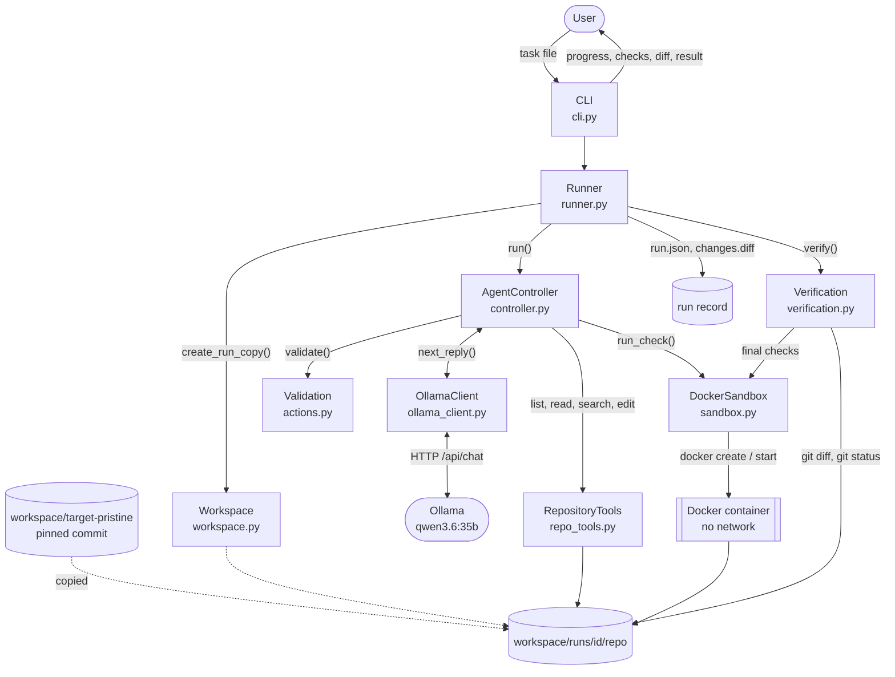
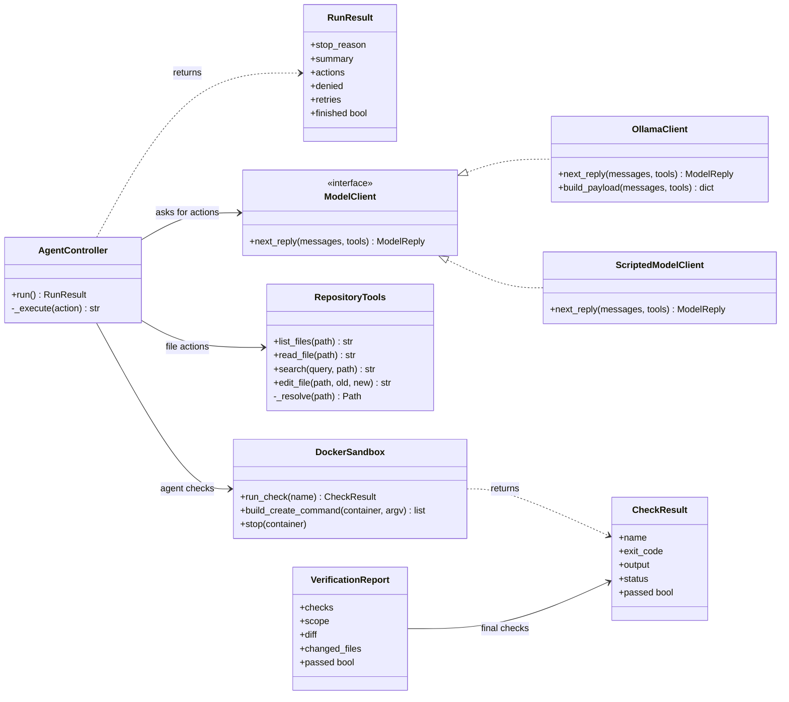
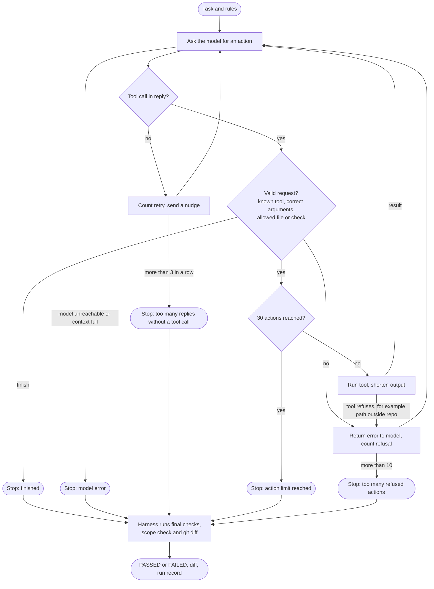
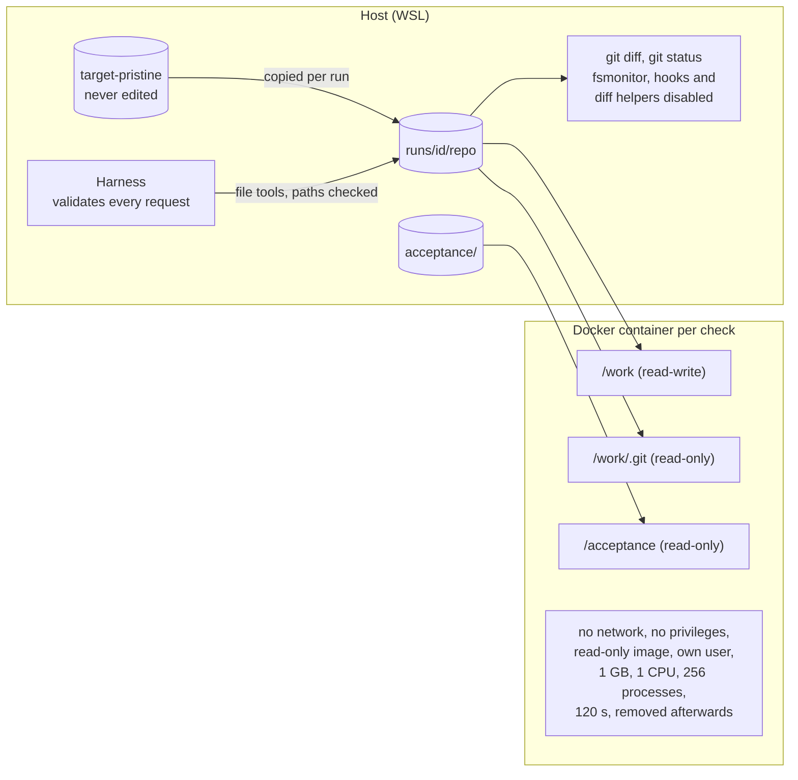

# Coding Harness

A small coding agent harness in Python, built for the AAIA semester project (Stage 1, Delivery 1). It takes a bug-fix task, lets a local language model change a disposable copy of a real repository through checked tools, verifies the result itself in a Docker sandbox, and shows the diff.

```
python -m harness run tasks/invalid_quantity.toml
```

The model only proposes actions. The harness validates every request, runs only allowed tools, enforces limits, and decides on its own whether the checks pass.

## Results

Every real run with `qwen3.6:35b` passed. No manual help was given: the task file went in, and a verified change came out.

| Run | Thinking | Actions | Refused | Agent time | Result |
|---|---|---|---|---|---|
| `20261005-164548-fd9a1f` | on | 15 | 0 | not recorded* | PASSED |
| `20261005-165938-c0fe68` | on | 14 | 0 | 37.2 s (38.7 s total) | PASSED |
| `20261005-172844-6fc70d` | off (`--no-think`) | 21 | 0 | 36.0 s (37.6 s total) | PASSED |

\* This run happened before timing was added to the run record. An earlier run with a development script, before the CLI existed, also passed (14 actions, about 45 s).

In each run the acceptance check went from 2 failed, 1 passed to 3 passed, all 20 existing unit tests still passed, and only `src/allocation/service_layer/handlers.py` changed. The model's fixes differed slightly between runs (where the new exception sits, whether it checks `cmd.qty` or `line.qty`). That's expected, and is why the result is judged by tests, not by comparing code.

With thinking off, each model reply is faster, but the agent took more steps: it repeated searches and tried regular expressions that plain-text search cannot match. Total time was about the same, but the run used 21 of its 30 allowed actions, against 14 to 15 with thinking on. Thinking stays on by default.

## Target and task

| | |
|---|---|
| Repository | [cosmicpython/code](https://github.com/cosmicpython/code), branch `master` |
| Commit | `14c84797ffa77255d53cf1a02fe6aafda2b68aeb` |
| Regression tests | `tests/unit` (20 tests; integration and end-to-end tests need Postgres and Redis and are not used) |

**The bug.** Nothing checks that an order quantity is positive. Allocating `-5` units from a batch of 10 leaves 15 available: a negative order adds stock. The behavior spans several modules: a command goes through the message bus to the handler and the domain model, and an out-of-stock notification can come back out.

**The task** (`tasks/invalid_quantity.toml`): reject quantities of zero or less with a new `InvalidQuantity` exception in the allocate handler, without changing stock or sending an out-of-stock notification.

- Files that may change: `src/allocation/service_layer/handlers.py`, `src/allocation/domain/model.py`
- Checks the agent may run itself: `unit_tests`
- Checks the harness runs afterwards: `acceptance`, `unit_tests`

**The acceptance check** (`acceptance/test_acceptance_invalid_quantity.py`) lives outside the agent's writable area and is mounted read-only into the sandbox. It uses its own test fakes, so it doesn't depend on files the agent could edit. A one-line fix only in `model.py` doesn't pass it, because the model would then report the product as out of stock and send a false notification.

On the starting code (`python -m harness baseline tasks/invalid_quantity.toml`):

```text
acceptance   FAILED    2 failed, 1 passed
  AttributeError: module 'allocation.service_layer.handlers' has no attribute 'InvalidQuantity'
unit_tests   PASSED    20 passed
```

## Requirements

- Windows 11 with WSL 2 (Ubuntu), or Linux. Developed and tested on Windows 11 with WSL 2 using mirrored networking.
- Python 3.11 or newer, and Git
- Docker (Docker Desktop with WSL integration on Windows)
- [Ollama](https://ollama.com) with a model that supports tool calls. Tested with `qwen3.6:35b` on an RTX 4070 SUPER (12 GB) with 64 GB RAM.

No accounts, API keys or other secrets are needed. Everything runs locally, and the settings in `config/target.toml` contain nothing secret.

## Setup

```bash
git clone https://github.com/linda-gan/swe25-aaia-coding-harness.git
cd swe25-aaia-coding-harness

python3 -m venv .venv
source .venv/bin/activate
pip install -r requirements.txt

./scripts/fetch_target.sh                  # clean clone of Cosmic Python at the pinned commit
docker build -t cosmic-sandbox sandbox/    # sandbox image with Cosmic Python's dependencies
docker pull python:3.12-slim               # used by the sandbox tests
ollama pull qwen3.6:35b
```

Check the setup:

```bash
pytest                          # 87 tests, no model needed
python -m scripts.check_model   # Ollama answers and makes a tool call
```


## Usage

```bash
python -m harness baseline tasks/invalid_quantity.toml   # final checks on the unchanged code
python -m harness run tasks/invalid_quantity.toml        # agent run, then verification

# Options for one run, without editing config/target.toml:
#   --model NAME   use another Ollama model
#   --no-think     turn thinking mode off (required for models without thinking support)
python -m harness run tasks/invalid_quantity.toml --no-think
```

`run` prints the task, live progress for every step (thinking, action, result, refusals), the agent's stop reason, the harness's own verification, the changed files, the colored diff, a PASSED or FAILED result, and the timing.

Each run gets its own folder, so runs never overwrite each other:

```
workspace/runs/<date-time-id>/
  repo/          the copy the agent worked on
  run.json       task, model, timing, every event and message, check results, diff
  changes.diff   the resulting diff
```

Exit codes: `0` all checks passed, `1` checks failed, `2` setup problem, `130` interrupted with Ctrl+C.

`python -m scripts.scripted_run <repo copy>` runs the whole pipeline with a scripted model that applies the known fix. It's useful for checking the tools and sandbox without a real model.

## Configuration

`config/target.toml` holds all settings:

| Section | Contents |
|---|---|
| `[target]` | repository URL, pinned commit, regression test path |
| `[sandbox]` | image, 120 s time limit per check, 1 GB memory, 1 CPU, 8,000-character output limit |
| `[checks]` | the only commands that can run in the sandbox, by name |
| `[limits]` | 30 actions, 10 refused actions, 3 replies in a row without a tool call, 6,000 characters of tool output per result |
| `[model]` | Ollama host, model name, thinking on or off, 32,768-token context, 600 s per reply |

A task file in `tasks/` sets the description, `editable_files`, `agent_checks` and `final_checks`.

## Architecture



How the modules map to the handout's parts:

| Part | Module | Responsibility |
|---|---|---|
| Setup | `config.py`, `scripts/fetch_target.sh`, `sandbox/Dockerfile` | settings, pinned target clone, sandbox image |
| Interface | `cli.py`, `__main__.py` | `run` and `baseline` commands; progress, checks, diff and result |
| Controller | `controller.py`, `actions.py`, `prompts.py` | the agent loop; validation of every request; system prompt |
| Model | `model.py`, `ollama_client.py` | model interface, scripted model for tests, Ollama client |
| Repository tools | `repo_tools.py` | list, read, search and edit inside the run copy |
| Execution | `sandbox.py` | configured checks in a locked-down container; output and exit codes |
| Limits | `controller.py`, `output.py`, `ollama_client.py` | action, refusal and retry limits; output limits; context limit |
| Verification | `verification.py`, `workspace.py`, `runner.py` | final checks, scope check, diff, run record |



`verify()` in `verification.py` runs the final checks through the same `DockerSandbox` and builds the `VerificationReport`. `run_task()` in `runner.py` ties the controller and verification together and writes the run record.

## The agent loop



Every result and every error goes back to the model as a message, so it can react. The loop never decides whether the task succeeded: "finished" only means the model said it was done. Verification runs however the loop ended, and a run where the model claims success but the checks fail ends as FAILED.

## Protecting the working environment



- **Disposable copy.** Each run works on a fresh copy of the pristine clone. Before copying, the harness checks that the pristine clone is at the pinned commit and has no local changes.
- **Contained execution.** Repository code and tests run only inside Docker, one container per check, with the restrictions shown above. The model can't send shell commands: it can only name a check from `[checks]`.
- **Stoppable commands.** Each container is created first and then started with a time limit, so it always exists under a known name. When time runs out, `docker rm --force` removes it, which kills every process inside it, including background children. Pressing Ctrl+C during a check triggers the same cleanup.
- **Checks in application code.** Every request is validated before it runs: the tool exists, the arguments are complete, correctly typed and not too long, edits go only to the task's editable files, and only the agent's checks can run. All file paths pass through one check that rejects absolute paths, `..` escapes and symlinks pointing outside the copy.
- **Git cannot be turned against the host.** The file tools block `.git`, and inside the container `/work/.git` is read-only. Git on the host runs with fsmonitor, hooks and external diff and textconv helpers disabled.
- **Untrusted input.** Model replies are parsed and validated, never executed directly. The system prompt tells the model to treat file contents and command output as data, not instructions.
- **No push, merge or deployment.** The pristine clone has no Git remote, the agent has no Git or network tool, and the container has no network.
- **Credentials stay outside.** No credentials exist in the project or in any copy, and containers only see the run copy and the acceptance tests.
- **Visible results.** A scope check fails the run if any file outside `editable_files` changed, for example a file written by code run in a test.

## Tests

```bash
pytest
```

All 87 tests run without a model, an account or an API key. The controller tests use a scripted model, and the client tests use a small local fake Ollama server. The 7 sandbox tests that start real containers are skipped when Docker or the `python:3.12-slim` image is missing.

| Handout test | Where |
|---|---|
| File tools | `test_repo_tools.py`: read, search and edit; `../`, absolute paths, `.git` and escaping symlinks rejected |
| Controller | `test_controller.py`: a scripted `read_file` call runs, and the model receives its result |
| Invalid request | `test_actions.py`, `test_controller.py`: unknown tools and invalid arguments give a clear error, and nothing runs |
| Failed command | `test_sandbox.py`: a nonzero exit code and its output stay visible. `test_runner.py`: a model claiming success without a fix ends as FAILED |
| Action limit | `test_controller.py`: a repeating scripted reply stops after the limit, and no further action runs |
| Output limit | `test_output.py`, `test_controller.py`, `test_sandbox.py`: large output is bounded and marked `[output shortened: ...]` |
| Bug fix | `test_runner.py`: with a fake sandbox in place of Docker, the acceptance check fails on the starting code and passes after the change, and existing tests still pass. The real check is shown by `baseline` and `run` (see Results) |

Further tests cover stuck commands (stopped together with their child processes), no network in the sandbox, read-only `.git` and acceptance mounts, run copies, the scope check, the Ollama client's error handling and context limit, and the run record.

## Limitations and observations

- One task and one target repository so far. Navigation, context management and sessions are planned for Stage 2.
- Context is protected only by a hard limit. A conversation that would exceed the model's context window stops the run instead of being summarized.
- The `search` tool matches plain text. The model sometimes searched with regular expressions such as `qty.*0`, even though the tool description says plain text: once in a run with thinking on, three times in the run with thinking off. Those searches found nothing, but cost actions.
- By design, the agent can't run the acceptance check: it sees only the task description and the unit tests.
- Run time depends on hardware. With `qwen3.6:35b` partly in system RAM, a run took about 40 seconds.

## Project layout

```
harness/              the harness (see Architecture)
tests/                87 automated tests
acceptance/           acceptance check, outside the agent's writable area
tasks/                task files
config/target.toml    all settings
sandbox/              Dockerfile and pinned dependencies for the sandbox image
scripts/              fetch_target.sh, check_model.py, scripted_run.py
workspace/            pristine clone and run folders (not committed)
```